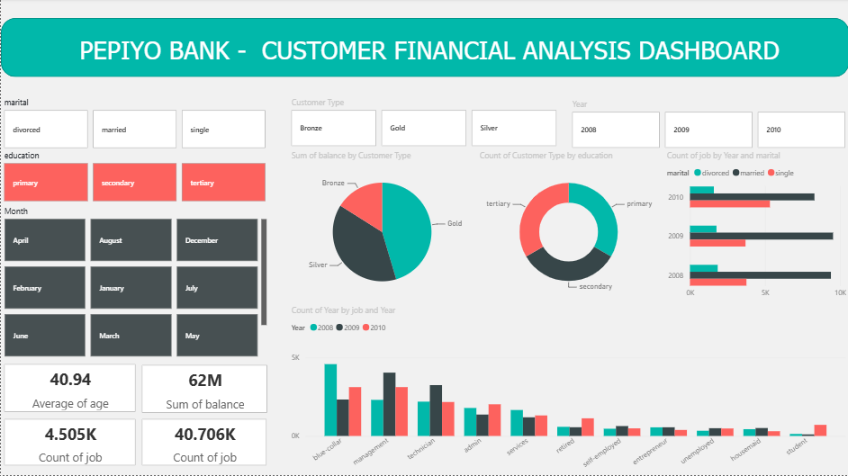

# DSA 3050 - Pepiyo Bank Customer Financial Analysis Dashboard
## Quiz 1: Introduction to Power BI Dashboards
Author: Jessica Kimani
---------------------------------------------------------------------------------------
## Project Overview
Customer financial analysis dashboard for Pepiyo Bank, analyzing customer demographics, account balances, and job distribution across marital status, education, and customer types.

## Dashboard Preview

## Key Insights
1. **Sum of Balance**: **62M** — Total customer account balances across all segments
2. **Average Age**: **41.051** — Average age of bank customers
3. **Count of Job**: **4.505K** — Total number of job records
4. **Count of Job (Secondary Metric)**: **40.706K** — Extended job count metric
5. **Highest Customer Type by Balance**: **Gold customers** hold the largest share of total balance (as shown in the pie chart)
6. **Education Distribution**: **Primary** education customers form the largest segment, followed by **secondary** and **tertiary**
7. **Year with Highest Job Count**: **2008** shows the highest count of jobs by year and marital status
8. **Job Category with Highest Count**: **Blue-collar** jobs dominate the customer base across all years (2008–2010)

## Dashboard Features
- **Slicers/Filters**: 
  - Marital status (divorced, married, single)
  - Education level (primary, secondary, tertiary)
  - Month selection (January–December)
  - Customer type (Bronze, Gold, Silver)
  - Year filter (2008, 2009, 2010)
- **Visualizations**:
  - Pie chart: Sum of balance by Customer Type
  - Donut chart: Count of Customer Type by education
  - Horizontal bar chart: Count of job by Year and marital status
  - Vertical bar chart: Count of Year by job and Year
  - KPI cards: Average age, Sum of balance, Count of job metrics

## Files Included
- `JESSICA DSA3050 QUIZ 1.pbix` → Power BI report file
- `CFAD.png` → Final dashboard screenshot
- `bank-full.csv` → Original dataset

## Tools Used
- Microsoft Power BI Desktop
- Microsoft Excel (Dataset)
---
